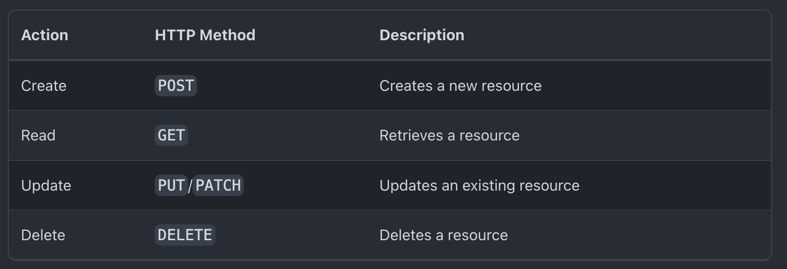

## Topic
> `How to Connect to an API with Javascript` on this repo we are going to learn about `how to connect with API`, this is just a simple beginner introduction to API, we are going to write from scratch [simple web app](https://taniarascia.github.io/sandbox/ghibli/) that connect to a [Studio Ghibli API](https://ghibliapi.herokuapp.com/), retrieve the data with Javascript, and display it on the front end of a website. This is not meant to be an extensive resource on APIs or REST - just the simplest possible example to get up and running. All the teaching are from [Tania Rascia](https://www.taniarascia.com/me), article [How to connect to an API with Javascript](https://www.taniarascia.com/how-to-connect-to-an-api-with-javascript/)

### PREREQUISITES
- Basic knowledge of HTML and CSS
- Basic knowledge of Javascript syntax and datatype
- Basic knowledge of working with JSON and Javascript objects. 

## keypoints and notes
### What a Web API is
> API stands for Application Program Interface, which can be defined as a set of methods of communication between various software components. In other words, an API allows software to communicate with another software.

> We'll be focussing specifically on Web APIs, which allow a web server to interact with third part software. In this case, web server is using HTTP request to communicate to a publicly available URL endpoint containing JSON data.

> You may be familiar with the concept of CRUD app, which stands for Create, Read, Update, Delete.

### Setting Up
> What is our objective? We want to get the data for all Studio Ghibili films and display the titles and description in a grid. For some background knowledge, Studio Ghibil is a Japanese animation studio that produced several films
> `./public/index.html` start by creating an index.html file
> `./public/style.css` for styling
> `./src/scripts.js` for javascript logic

> Now we have HTL and CSS set up

### Connecting to the API
> Let's take a look at the [Studio Ghibil API documentation](https://ghibliapi.herokuapp.com/). Since an API can be accessed by many different methods - Javascript, PHP, Ruby, Python and so on - the documentation for most APIs doesn't tend to give specific instruction for how to connect

